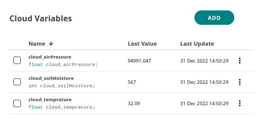

# Arduino-Cloud-Plant-Monitoring
Monitor your plant in the Arduino Cloud!
# Parts you need
1. Wemos D1 R1 (ESP8266)
2. BMP280
3. Soil Moisture Sensor
4. Wires
# Circuit connections
BMP280 to Wemos D1 R1
SCL - SCL
SDA - SDA
VCC - 3.3V
GND - GND
  
Soil Moisture Sensor to Wemos D1 R1
VCC - 5V
SIG - A0
GND - GND
# Programming
First create a thing in the Arduino Cloud (make sure you are logged in). Then create 3 variables.

And then create a device for the Wemos D1 R1 and make sure you have copied the device id and secret key.
After that configure your network. 

Then go to the sketch tab and copy the code from this repo in the ```Code```
folder and paste it. Then there will be a prompt to install the arduino create agent if you haven't installed 
it. After installing it select your board and port then upload the code.
