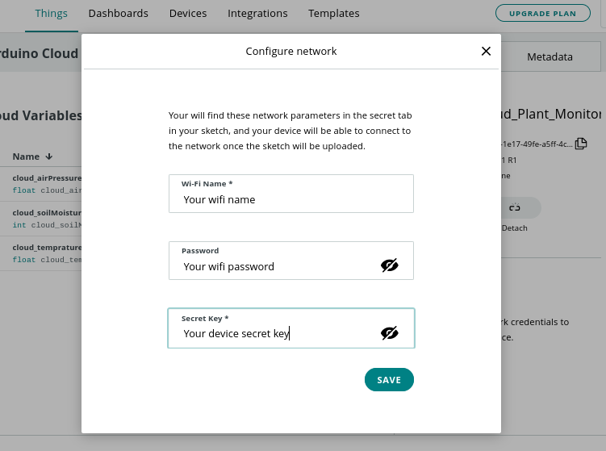

# Arduino-Cloud-Plant-Monitoring
Monitor your plant in the Arduino Cloud!
# Parts you need
1. Wemos D1 R1 (ESP8266)
2. BMP280
3. Soil Moisture Sensor
4. Wires
# Circuit connections
BMP280 to Wemos D1 R1
1. SCL - SCL
2. SDA - SDA
3. VCC - 3.3V
4. GND - GND
  
Soil Moisture Sensor to Wemos D1 R1
1. VCC - 5V
2. SIG - A0
3. GND - GND
# Programming
First create a thing in the Arduino Cloud (make sure you are logged in). Then create 3 variables.


For temprature and air pressure set the variable as a ```float``` for the soil moisture set the variable as an ```int``` set the variable permission as
read only and for variable update policy set it to periodicaly.
And then create a device for the Wemos D1 R1 by clicking on select device then click on ```Set up a 3rd party device```
then select ESP8266 then select Wemos D1 R1 then click ```continue``` give your device a name and make sure you have 
copied the device id and secret key.
After that configure your network. 

Then go to the sketch tab and copy the code from this repo in the ```Code```
folder and paste it. Then there will be a prompt to install the arduino create agent if you haven't installed 
it. After installing it select your board and port then upload the code. Now for creating the Dashboard go to the Dashboard tab then create a new dashboard. to add new widgets click on add for this project I'm going to use a gauge and two charts. For the gauge link it to the soil moisture variable 
give it a name and the value range min: 0 max: 1023 because analog read values range from 0 to 1023.

Now for the charts link each of them to temprature variable and the air pressure variable then give it a name.


